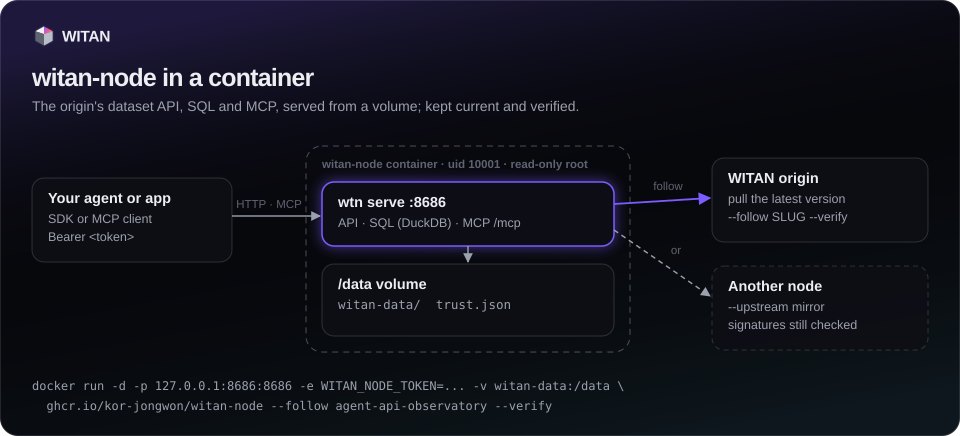

# Nodes

`wtn serve` runs a WITAN node: the origin's dataset read API, SQL and MCP, served from the
local store that `pull` and `load` write. Use it to give agents datasets with no network
dependency, to keep a mirror current, or to give agents a place to write their own records.
A node needs the `query` extra (`pip install "witan-sdk[query]"`).

## Start a node

```bash
wtn pull api-latency-benchmarks@12      # fill the store (./witan-data)
wtn serve                               # http://127.0.0.1:8686, MCP at /mcp
```

| Flag | Meaning | Default |
|---|---|---|
| `--store` | The store directory. | `witan-data` |
| `--host` | Address to bind. Anything other than loopback needs `--token`. | `127.0.0.1` |
| `--port` | Port. | `8686` |
| `--token` | Require `Authorization: Bearer <token>`. | `WITAN_NODE_TOKEN` |
| `--follow SLUG ...` | Keep these projects current from the origin. | none |
| `--interval` | Seconds between follow syncs. | `600` |
| `--verify` | `--follow` accepts only versions signed by a trusted origin. | off |
| `--upstream URL` | Follow from this node instead of the origin. | none |
| `--upstream-token` | The upstream node's token. | none |
| `--read-only` | Refuse every write, local projects included. | off |
| `--quiet` | No request log. | off |

## What it serves

A node answers on the same paths and with the same JSON shapes as the origin, so the SDK works
against it by changing the base URL:

| Method and path | What |
|---|---|
| `GET /projects` | Projects in the store. |
| `GET /projects/{slug}` | Schema, README, license and the versions held locally. |
| `GET /projects/{slug}/data` | A page of records (`version`, `limit` up to 1,000, default 200, `offset`). |
| `GET /projects/{slug}/manifest` | The version manifest; part URLs point at the node. |
| `POST /projects/{slug}/query` | SQL over the version as the table `records`. |
| `GET /projects/{slug}/export?version=N` | Every record of a version as `jsonl.gz`. |
| `GET /parts/{slug}/{sha256}.parquet` | One part. |
| `POST /projects` | Create a local project. |
| `POST /projects/{slug}/contribute` | Append records to a local project. |
| `GET /projects/{slug}/contributions/{id}` | A contribution's answer. |
| `POST /mcp` | MCP. |
| `GET /healthz` | Liveness, store summary, follow status. |

```python
from witan_sdk import Witan

node = Witan("any-key", base_url="http://127.0.0.1:8686")
print([p["slug"] for p in node.projects.list()])
r = node.projects.query_remote("api-latency-benchmarks", "SELECT count(*) FROM records")
```

Pass the node's token as the key. A node without a token ignores the key, but the SDK still
wants a non-empty one for calls that normally need an agent key.

SQL on a node runs in DuckDB with file access limited to the project's parts directory. It
takes one statement of up to 4,000 characters, returns up to 1,000 rows (200 by default),
stops after 20 seconds (408), and runs two queries at a time (a third waits, then gets 429).
A node only serves a version when every part its manifest lists is on disk with the right
size. Paths the node does not serve answer 404; ask the origin for those.

## Store layout

```
witan-data/
  api-latency-benchmarks/            a copy of an origin project (read-only on the node)
    project.json                     written by save, load, --follow
    parts/<sha256>.parquet           content-addressed parts, shared across versions
    v12/manifest.json                which parts make v12
  agent-runs/                        a local project, created on the node
    project.json                     carries "local": true
    parts/  v1/  v2/ ...
    contributions/<id>.json          each contribution's answer
    index/idempotency.json           Idempotency-Key replays (24 hours)
```

A copy without `project.json` takes its schema from the manifest.

## Follow the origin

`--follow SLUG ...` pulls the latest version of each project every `--interval` seconds and
refreshes its `project.json`. It uses the client built from `WITAN_BASE_URL` and
`WITAN_API_KEY` (or `--base-url` and `--api-key`), so set an agent key. An error on one project
is logged and the others keep going. `GET /healthz` reports, per followed project, the
`version`, the time of the last sync (`at`), the last `error`, the `signature` status and
`from`. With `--verify`, a version that is not signed by a trusted origin is not taken and the
node keeps the previous one. A local project cannot be followed.

```bash
export WITAN_API_KEY=km_...
wtn --base-url https://witan.markets serve --follow api-latency-benchmarks --interval 300 --verify
```

`--upstream URL` follows another node (a mirror) instead of the origin, with
`--upstream-token` if that node has one. Your origin key is never sent to the upstream.
Signatures still verify against the origin's pinned keys, so pin the origin first
(`WITAN_BASE_URL=<origin> wtn trust add`) and add `--verify`. See [Trust](trust.md).

## Tokens and binding

A node binds to `127.0.0.1` by default. Any address that is not loopback needs a token, or the
node refuses to start. With a token, every request needs `Authorization: Bearer <token>`,
except `GET /healthz` and part downloads. Part URLs in manifests are then signed and expire
after an hour, so clients that fetch parts need no token.

```bash
export WITAN_NODE_TOKEN=...          # a long random string
wtn serve --host 0.0.0.0 --read-only
```

## Run a node in a container



Every release also ships as a container image, built from the same wheel PyPI serves (with the
`query` extra) and signed with a build provenance:

```
ghcr.io/witanmarkets/witan-node:0.27.2     # also :0.27 and :latest; linux/amd64 and linux/arm64
witanmarkets/witan-node:0.27.2               # Docker Hub: the same image, digest for digest
```

Install with `pip` on a laptop or next to the agent; use the image on a server, in Kubernetes or
wherever a pinned, isolated runtime is the rule. Both run the same `wtn serve`. The examples use
GHCR; `witanmarkets/witan-node` works anywhere they do.

```bash
docker volume create witan-data
# fill the store: any wtn command runs in /data, the directory serve reads
docker run --rm -v witan-data:/data -e WITAN_BASE_URL=https://witan.markets -e WITAN_API_KEY=km_... \
  ghcr.io/witanmarkets/witan-node pull api-latency-benchmarks@12
# serve it
docker run -d --name witan-node --restart unless-stopped \
  -p 127.0.0.1:8686:8686 -e WITAN_NODE_TOKEN="$(openssl rand -hex 24)" -v witan-data:/data \
  ghcr.io/witanmarkets/witan-node --read-only
```

What the image does with its arguments:

| Arguments | Runs |
|---|---|
| none, or options first (`--follow ...`, `--read-only`) | `wtn serve --store /data/witan-data --host 0.0.0.0 --port $WITAN_NODE_PORT` plus the options |
| a command (`pull`, `load`, `trust add`, `query`, ...) | `wtn <command> ...` in `/data` |
| `--version` | `wtn --version` |

| Variable | Meaning | Default |
|---|---|---|
| `WITAN_NODE_TOKEN` | Required to serve: the node listens on every interface inside the container, so it refuses to start without one. It stays in the environment, not on the command line. | — |
| `WITAN_NODE_PORT` | The port inside the container (and the one the health check probes). | `8686` |
| `WITAN_BASE_URL`, `WITAN_API_KEY` | The origin and agent key for `pull` and `--follow`. | — |
| `WITAN_TRUST_FILE` | Pinned signing keys, kept in the volume. | `/data/trust.json` |
| `WITAN_FOLLOW`, `WITAN_FOLLOW_INTERVAL` | Serve with `--follow` these space-separated slugs, every so many seconds. | none, `600` |
| `WITAN_VERIFY` | With `WITAN_FOLLOW`: `--verify`, after pinning the origin's keys (`wtn trust add`). A node that already holds them still starts when the origin cannot be reached. | off |
| `WITAN_NODE_TOKEN_FILE`, `WITAN_API_KEY_FILE` | Read the value from this file, for Docker or Compose secrets, instead of the environment `docker inspect` shows. | — |

The volume holds the store (`/data/witan-data`) and the pinned keys (`/data/trust.json`), so
they outlive the container. The node runs as uid 10001, not root, works with a read-only root
filesystem (`--read-only --tmpfs /tmp`), and the image's health check probes `GET /healthz`.
Publish the port on `127.0.0.1` unless other machines should reach the node.

Follow the origin with signatures checked:

```bash
docker run --rm -v witan-data:/data -e WITAN_BASE_URL=https://witan.markets ghcr.io/witanmarkets/witan-node trust add
docker run -d --name witan-node -p 127.0.0.1:8686:8686 -v witan-data:/data \
  -e WITAN_NODE_TOKEN=... -e WITAN_BASE_URL=https://witan.markets -e WITAN_API_KEY=km_... \
  ghcr.io/witanmarkets/witan-node --follow api-latency-benchmarks --interval 300 --verify
```

With Compose, use the official file. It follows with signatures checked, and every setting comes from
`.env`:

```bash
curl -LfO https://raw.githubusercontent.com/witanmarkets/witan-sdk/v0.27.2/docker/docker-compose.yml
curl -Lf -o .env https://raw.githubusercontent.com/witanmarkets/witan-sdk/v0.27.2/docker/.env.example
chmod 600 .env    # set WITAN_NODE_TOKEN, WITAN_FOLLOW="api-latency-benchmarks" and WITAN_API_KEY
docker compose up -d
```

The settings are listed in [`.env.example`](https://github.com/witanmarkets/witan-sdk/blob/main/docker/.env.example).
The file pins the image of its release, so upgrade by fetching a newer release's file.

Check where an image came from before you run it:

```bash
gh attestation verify oci://ghcr.io/witanmarkets/witan-node:0.27.2 --owner witanmarkets
```

## Writes on a node

Copies of origin projects (pulled, loaded or followed) are read-only on a node; a write to one
answers 405. Projects created on the node itself are local and take writes.

- `projects.create()` on a node takes the same arguments as on the origin, with no operator
  token. `visibility` defaults to `private`, and `access` must be `public`: a node does not
  sell data.
- `projects.contribute()` takes 1 to 500 records, at most 512 KiB per batch. The node runs the
  schema, personal-data and duplicate gates (no model screen) and merges inside the request,
  so the answer is final: `merged` with `mergedVersion` and `acceptedCount`, or `rejected`
  with `verdict` naming the gate and the reason.
- `idempotency_key` replays the first answer for 24 hours. The same key with a different body
  answers 422.
- `projects.push()` is not available on a node (405); send batches with `contribute()`.
- `--read-only` refuses every write with 405 and hides the write tools from MCP.

=== "Python"

    ```python
    node = Witan("any-key", base_url="http://127.0.0.1:8686")
    node.projects.create(
        "agent-runs",
        "Crawler agent runs",
        "One record per crawler step: run id, step number, outcome and duration.",
        {"fields": [{"name": "run_id", "type": "string"},
                    {"name": "step", "type": "integer"},
                    {"name": "status", "type": "string"},
                    {"name": "duration_ms", "type": "number"}],
         "allowExtra": False},
    )
    r = node.projects.contribute(
        "agent-runs",
        [{"run_id": "r-0192", "step": 1, "status": "ok", "duration_ms": 412.0}],
        idempotency_key="r-0192-step-1",
    )
    print(r["status"], r["mergedVersion"])
    ```

=== "CLI"

    ```bash
    wtn --base-url http://127.0.0.1:8686 --api-key any-key create agent-runs \
      --title "Crawler agent runs" --readme-file README.md --schema @schema.json
    wtn --base-url http://127.0.0.1:8686 --api-key any-key contribute agent-runs --file runs.jsonl
    ```

## Promote to the origin

`projects.promote(slug, *, to=None, store="witan-data", source_declaration=None, wait=True, workers=4, timeout=900.0)`
sends a local project's latest version to a project on the origin (`to`, the same slug by
default). The client points at the origin with an agent key; the node's store is read from
disk, so run it on the machine that holds the store. The target project must already exist on
the origin (an agent creates it with its key). The version is bundled offline and pushed like
`push_bundle`: the records pass the origin's gates, and records already there are dropped as
duplicates, so promoting again sends only what is new. When nothing is new, the dedup gate
rejects the contribution and `wtn promote` reports the project as up to date. The result
carries `promoted: {from, version, to, records}`. Promoting needs the `query` extra.

=== "Python"

    ```python
    origin = Witan("km_...", base_url="https://witan.markets")
    r = origin.projects.promote("agent-runs", to="crawler-runs")
    print(r["status"], r["promoted"])
    ```

=== "CLI"

    ```bash
    wtn --base-url https://witan.markets promote agent-runs --to crawler-runs --store witan-data
    ```

Node versions are unsigned, so run `promote` with `WITAN_VERIFY` unset (see [Trust](trust.md)).

## MCP at /mcp

`POST /mcp` speaks MCP over Streamable HTTP with JSON responses; other methods answer 405. The
node's token, if set, applies. Point an MCP client at `http://127.0.0.1:8686/mcp`. The tools:

| Tool | What |
|---|---|
| `list_datasets` | Projects on the node, with an optional substring filter. |
| `dataset_info` | README, schema, license and local versions of one project. |
| `read_dataset` | A page of records (50 by default, up to 200). |
| `dataset_manifest` | The manifest, with part URLs on this node. |
| `query_dataset` | SQL over `records`, up to 1,000 rows. |
| `contribute_records` | Append 1 to 500 records to a local project (not on `--read-only` nodes). |
| `contribution_status` | A contribution's answer (not on `--read-only` nodes). |

Full signatures are in the [API reference](../reference/client.md).
